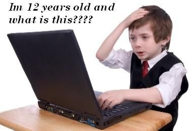

!SLIDE 
##  How do you change the context of a function?
<iframe style="width: 100%; height: 500px" src="http://jsfiddle.net/rauhryan/hs7D9/embedded/js,result/presentation"></iframe>

!SLIDE 
##  Call and apply do the same thing
<iframe style="width: 100%; height: 500px" src="http://jsfiddle.net/rauhryan/b4yN7/embedded/js,result/presentation"></iframe>

!SLIDE 
##  Pop quiz hot shot!
<iframe style="width: 100%; height: 500px" src="http://jsfiddle.net/rauhryan/7b5uP/embedded/js,result/presentation"></iframe>

!SLIDE 
##  Pop quiz hot shot!
<iframe style="width: 100%; height: 500px" src="http://jsfiddle.net/rauhryan/VVbQM/embedded/js,result/presentation"></iframe>

!SLIDE 
##  What does the new keyword give us?
<iframe style="width: 100%; height: 500px" src="http://jsfiddle.net/rauhryan/nsBac/embedded/js,result/presentation"></iframe>

!SLIDE 
##  How would you implement this?
<iframe style="width: 100%; height: 500px" src="http://jsfiddle.net/rauhryan/4uhyu/embedded/js,result/presentation"></iframe>

!SLIDE center

