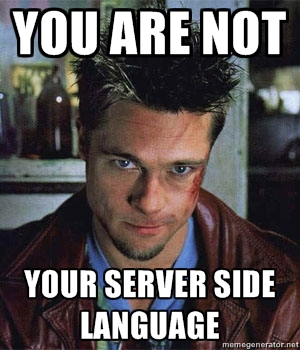
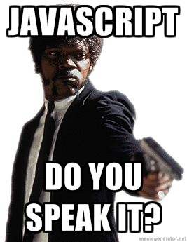

!SLIDE center

!SLIDE center

!SLIDE incremental bullets

# Goals

* Learn something you didn't already know
* Have a general understanding of the different ways to call a
  javascript function
* Better understand jQuery.proxy() & Protoype's bind

!SLIDE center

#Credit where credit is due

### [ejohn.org/apps/learn](http://ejohn.org/apps/learn)

!SLIDE smaller

# Prototype's bind

    @@@ javascript
    Function.prototype.bind = function(){ 
      var fn = this, 
          args = Array.prototype.slice.call(arguments), 
          object = args.shift(); 
      return function(){ 
        return fn.apply(object, 
          args.concat(Array.prototype.slice.call(arguments))); 
      }; 
    };

!SLIDE center

# We'll get back to this later

